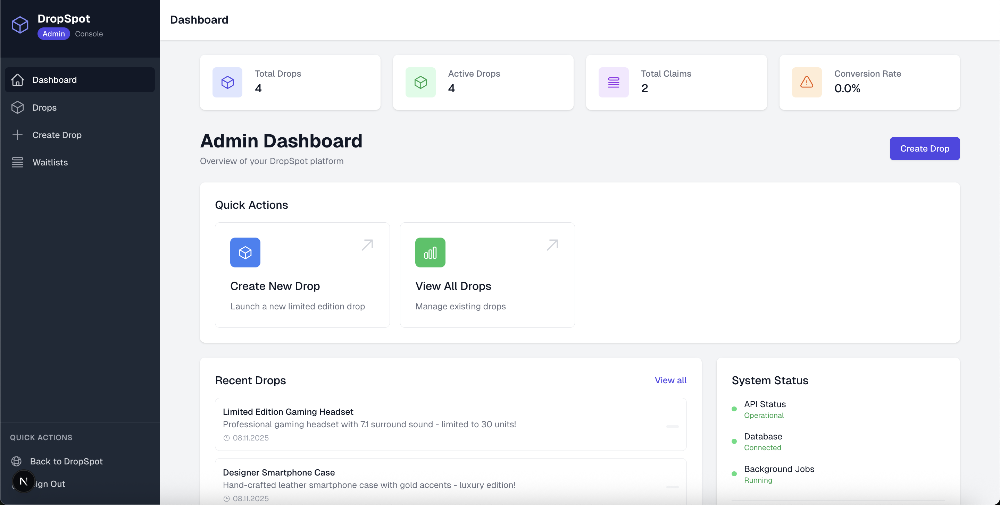
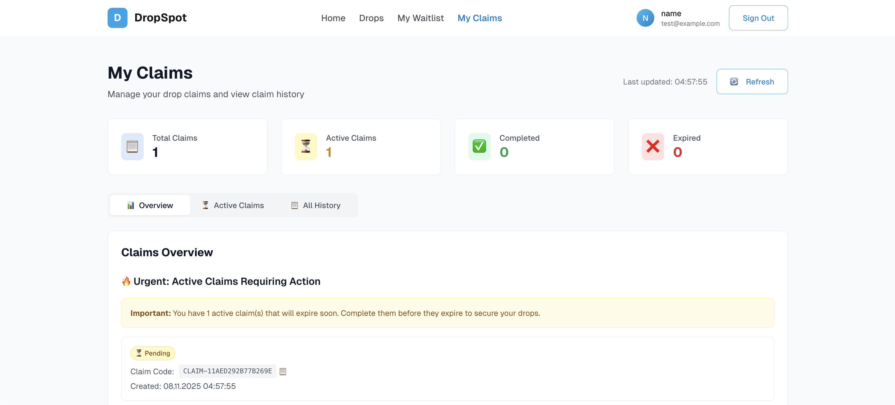

# DropSpot Frontend

## 🎯 Overview

DropSpot is a modern React application that enables brands to launch exclusive product drops. Users can join waitlists, compete based on priority scoring, and claim items during designated windows. Built with Next.js 15, TypeScript, and Tailwind CSS.

## ✨ Features

- **🎪 Drop Management** - Browse and discover exclusive product releases
- **📋 Waitlist System** - Join waitlists and track position in real-time
- **⚡ Claim Process** - Fast claiming during designated time windows
- **🔐 Authentication** - Secure user registration and sign-in
- **👑 Admin Dashboard** - Complete management interface for drops
- **📱 Responsive Design** - Modern UI optimized for all devices

## 🛠 Tech Stack

- **Framework:** Next.js 15 with App Router
- **Language:** TypeScript
- **Styling:** Tailwind CSS
- **Authentication:** NextAuth.js
- **State Management:** Zustand
- **Icons:** Lucide React
- **UI Components:** Custom component library

## 📦 Installation

```bash
git clone https://github.com/Developer-Emre/dropspotapp.git
cd dropspotapp
npm install
```

### Environment Setup

Create `.env.local` file:

```env
NEXTAUTH_SECRET=your-secret-key
NEXTAUTH_URL=http://localhost:3000
```

### Development

```bash
npm run dev
```

Open [http://localhost:3000](http://localhost:3000) to view the application.

## 🚀 User Flow

1. **Register/Sign In** → Create account or authenticate
2. **Browse Drops** → Discover available product releases
3. **Join Waitlist** → Enter waitlist for desired drops
4. **Track Position** → Monitor real-time waitlist position
5. **Claim Item** → Secure item during claim window
6. **View Claims** → Access claim history and codes

## 🏗 Architecture

```
src/
├── app/                    # Next.js App Router pages
├── components/            # React components
│   ├── admin/            # Admin dashboard components
│   ├── auth/             # Authentication components
│   ├── claims/           # Claim functionality
│   ├── drops/            # Drop-related components
│   ├── layout/           # Navigation and layout
│   └── ui/               # Reusable UI components
├── hooks/                # Custom React hooks
├── store/                # Zustand state management
└── types/                # TypeScript definitions
```

## 🎨 Component Features

### Authentication
- **AuthRedirect** - Prevents authenticated users from accessing auth pages
- **Protected Routes** - Automatic redirection for unauthenticated users

### UI Components
- **LoadingSpinner** - Multiple variants (spinner, pulse, dots, fullscreen)
- **ErrorBoundary** - Global error handling with fallback UI
- **Toast Notifications** - Real-time feedback for user actions

### Drop Management
- **DropCard** - Clean product display with waitlist integration
- **ClaimButton** - Smart claim functionality with auth checks
- **WaitlistPositionTracker** - Real-time position updates

### Admin Dashboard
- **AdminLayout** - Professional sidebar navigation
- **CRUD Operations** - Complete drop management interface
- **DeleteConfirmationModal** - Safe deletion with confirmation

## 📊 State Management

Using Zustand for simple, TypeScript-friendly state management:

- **claimStore** - Manages claim operations and history
- **waitlistStore** - Handles waitlist joins and position tracking
- **adminStore** - Controls admin dashboard state

## 🎯 Key Features

### Real-time Updates
- Live waitlist position tracking
- Instant claim status updates
- Dynamic drop availability

### Error Handling
- Global error boundaries
- Toast notification system
- Graceful failure recovery

### Performance Optimizations
- Lazy loading for components
- React.memo for expensive calculations
- Zustand selectors prevent unnecessary re-renders
- Next.js automatic code splitting

### Responsive Design
- Mobile-first approach
- Tailwind CSS utility classes
- Adaptive layouts for all screen sizes

## 🔒 Authentication Flow

1. **Registration** - Email/password with validation
2. **Sign In** - NextAuth.js session management
3. **Protected Actions** - Auth checks with toast feedback
4. **Callback URLs** - Preserve intended navigation after auth

## 📱 Mobile Experience

- Touch-optimized interfaces
- Responsive navigation
- Mobile-friendly forms
- Optimized loading states

## 🚀 Deployment

```bash
npm run build
npm start
```

Built for deployment on Vercel with automatic optimizations.

## 📈 Performance

- **Core Web Vitals** optimized
- **Image optimization** with Next.js
- **Bundle splitting** for faster loads
- **Caching strategies** for better performance

## 🎨 Design System

- **Color Palette** - Consistent purple/blue theme
- **Typography** - Clear hierarchy with Inter font
- **Spacing** - Tailwind spacing scale
- **Components** - Reusable design patterns

## 📱 Screenshots

### Dashboard Overview
<div align="center">
  
  <p><i>Main dashboard showing active drops and navigation</i></p>
</div>

### Drop Listings
<div align="center">
  
  <p><i>Browse available drops with real-time status updates</i></p>
</div>

### Waitlist Management
<div align="center">
  
  <p><i>Join waitlists and track your position in real-time</i></p>
</div>

---

**Frontend-focused modern React application showcasing advanced patterns and user experience design.**